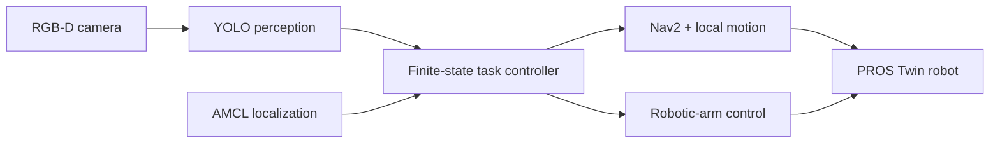

# Robotic Navigation and Exploration

Graduate-level external coursework in robotics completed at National Tsing Hua University.

This repository documents a progression from path planning and motion control to reinforcement learning, visual perception, and an integrated autonomous mobile-manipulation system in PROS Twin.

> Path Planning → Motion Control → Reinforcement Learning → Visual Perception → System Integration

## Final Project: Autonomous Perception, Navigation, and Manipulation

The final project integrates YOLO-based perception, RGB-D sensing, AMCL localization, Nav2 navigation, local vehicle control, and robotic-arm manipulation through a finite-state task controller.

**[Watch the full demonstration on YouTube](https://youtu.be/snCtO602PGs)** · **[Local 2.5-minute preview](final-autonomous-robot/assets/demo.mp4)** · **[Read the technical report](https://anyi-lee.github.io/robotic-navigation-and-exploration/final-autonomous-robot/report/final-technical-report.pdf)** · **[Browse all reports](https://anyi-lee.github.io/robotic-navigation-and-exploration/)** · **[Explore the final-project code](final-autonomous-robot/)**

### Demonstrated tasks

| Task | Pipeline | Result |
| --- | --- | --- |
| Bear retrieval and return | Detect → align → grasp → navigate home → release | Completed |
| Bridge traversal | Carry → traverse constrained bridge → recover → return | Completed |
| Door-handle interaction | Detect knob → align → position arm → press/push | Partially completed |

### System architecture

The controller uses global navigation in open mapped space and task-specific local control for close alignment, bridge traversal, grasping, and door interaction. Reliability mechanisms include multi-frame confirmation, target-loss recovery, depth fallback using image geometry, dynamic home-pose capture, and AMCL-based return verification.

## Coursework progression

| Module | Focus | Selected result |
| --- | --- | --- |
| [HW1: Path Planning](hw1-path-planning/) | A* and RRT* | Grid and sampling-based planning implementations |
| [HW2: Motion Control](hw2-motion-control/) | Kinematic models and trajectory tracking | PID, Pure Pursuit, Stanley, and LQR controllers |
| [HW3: Reinforcement Learning](hw3-reinforcement-learning/) | PPO and reward shaping | 259.3584 path-tracking evaluation score |
| [HW4: Visual Perception](hw4-visual-perception/) | Object detection and semantic segmentation | Bear/knob detection and road/bridge segmentation |
| [Final: Autonomous Robot](final-autonomous-robot/) | Perception, navigation, and manipulation | Two complete tasks and one partial door-interaction task |

## Technology

Python · ROS 2 · Nav2 · AMCL · YOLO11 · RGB-D · PyTorch · PPO · OpenCV · Roboflow · Foxglove · PROS Twin

## Environment and reproducibility

The work was developed and evaluated in the course-provided PROS Twin and ROS 2 environment. The repository is a portfolio archive of selected implementations, trained weights, reports, and results; it is not a standalone replacement for the original ROS 2 workspace. Reproduction requires the upstream `pros_car` and `pros_app` frameworks, their course launch/configuration files, and the corresponding ROS 2, Nav2, AMCL, OpenCV, PyTorch, and Ultralytics dependencies. Exact package-version metadata was not preserved, so the reports and demonstration videos are provided as the primary record of the evaluated results.

## Authorship and course framework

The assignments and final project were built on course-provided frameworks. This repository contains selected implementation files, results, and reports rather than complete copies of those frameworks. My final-project contribution centers on task-level state logic, perception integration, navigation reliability, and manipulation coordination.

See [THIRD_PARTY_NOTICES.md](THIRD_PARTY_NOTICES.md) for upstream projects and attribution details.

## Author

An-Yi Lee · [GitHub](https://github.com/anyi-lee)
