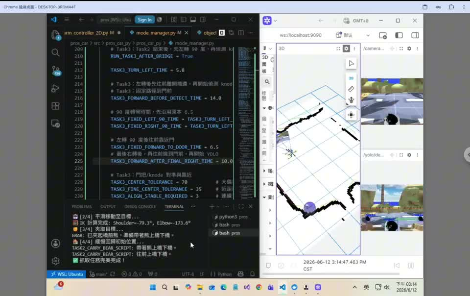
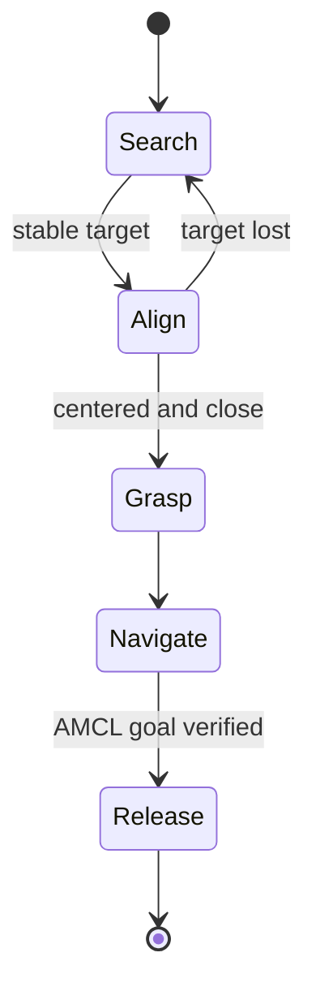

# Final Project: Autonomous Mobile Manipulation

This individual final project integrates perception, localization, navigation, vehicle control, and robotic-arm manipulation in the PROS Twin simulation environment.

**[Watch the full demonstration on YouTube](https://youtu.be/snCtO602PGs)** · **[Local 2.5-minute preview](assets/demo.mp4)** · **[Open the seven-page PDF](https://anyi-lee.github.io/robotic-navigation-and-exploration/final-autonomous-robot/report/final-technical-report.pdf)**

## Task results

| Task | Implemented behavior | Result |
| --- | --- | --- |
| Bear retrieval | Search, visual alignment, arm preparation, grasp, Nav2 return, AMCL verification, release | Completed |
| Bridge traversal | Bear retrieval, stable grasp, constrained local traversal, recovery, return navigation | Completed |
| Door interaction | Knob detection, coarse approach, fine visual alignment, handle-press sequence, forward push | Partially completed |

Task 3 reached perception, alignment, and manipulation testing, but the complete door-opening behavior was not reliable during the final demonstration.

## Control architecture

Nav2 handles long-range movement in mapped open space. Local commands handle close visual alignment and predictable motion in constrained areas such as the bridge and door approach.

## Reliability mechanisms

- **Multi-frame confirmation:** major transitions require repeated consistent detections.
- **Target-loss recovery:** controlled search resumes when the target leaves the camera view.
- **Depth fallback:** vertical image position supplements unstable close-range depth.
- **Dynamic home pose:** the controller records the initial AMCL pose at task start.
- **Return verification:** object release requires geometric proximity to the stored goal rather than relying only on a navigation-finish flag.
- **Plan recovery:** empty or exhausted Nav2 plans trigger goal publication and replanning instead of false completion.

## Selected source

| File | Project-specific contribution |
| --- | --- |
| [`mode_manager.py`](src/mode_manager.py) | Multi-task finite-state controller and recovery logic |
| [`nav_processing.py`](src/nav_processing.py) | Nav2 plan acquisition, tracking, replanning, and finish checks |
| [`object_detection_node.py`](src/object_detection_node.py) | YOLO/RGB-D target data generation |
| [`ros_communicator.py`](src/ros_communicator.py) | ROS 2 topic, AMCL, goal, and command integration |
| [`arm_controller_2D.py`](src/arm_controller_2D.py) | Target-frame conversion and grasp execution support |
| [`data_processor.py`](src/data_processor.py) | Sensor-data validation and AMCL processing guard |

Compared with the clean course-framework baseline at `pros_car` commit `3659e63`, the submitted project modified five Python files. The largest change was `mode_manager.py`, which grew from 87 to 1,447 lines as the task controller evolved.

## Execution environment

This project was run inside the course-provided PROS Twin ROS 2 workspace rather than as a standalone Python application. Reproduction requires the upstream `pros_car` and `pros_app` repositories, the course launch and configuration files, a working Nav2/AMCL setup, and the ROS 2 perception dependencies used by `object_detection_node.py` (`cv_bridge`, OpenCV, PyTorch, and Ultralytics YOLO). The selected files in [`src/`](src/) are intended to be placed in their corresponding course packages, with the trained detection weights available to the YOLO ROS 2 package. Exact dependency versions were not recorded, so this repository documents the implementation and evaluated behavior without claiming one-command reproducibility.

## Framework attribution

The project builds on the course-provided [pros_car](https://github.com/asd56585452/pros_car) and [pros_app](https://github.com/asd56585452/pros_app) frameworks. Only selected modified files are included here; the complete upstream repositories are not redistributed.
