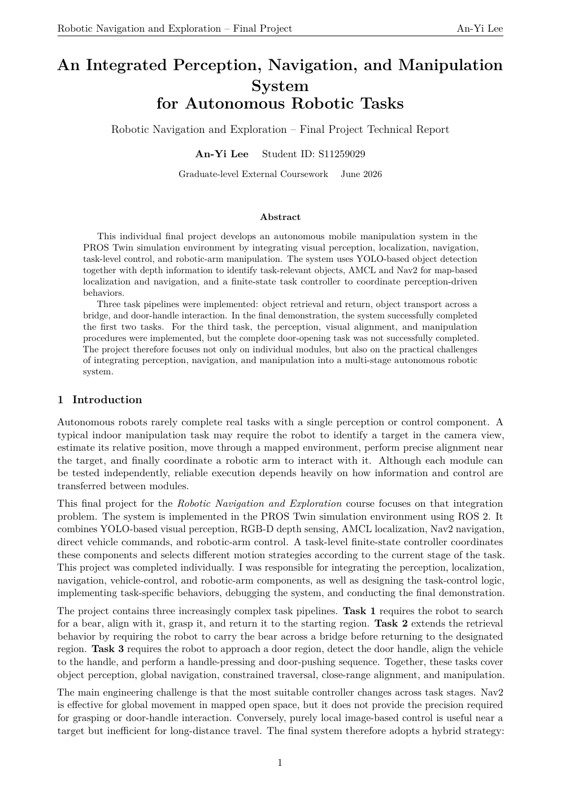

# Final Technical Report: Autonomous Robot System

Seven-page technical report for an integrated perception, localization, navigation, vehicle-control, and robotic-arm manipulation system in PROS Twin and ROS 2.

**[Open the full PDF in your browser](https://anyi-lee.github.io/robotic-navigation-and-exploration/final-autonomous-robot/report/final-technical-report.pdf)**

## First-page preview

