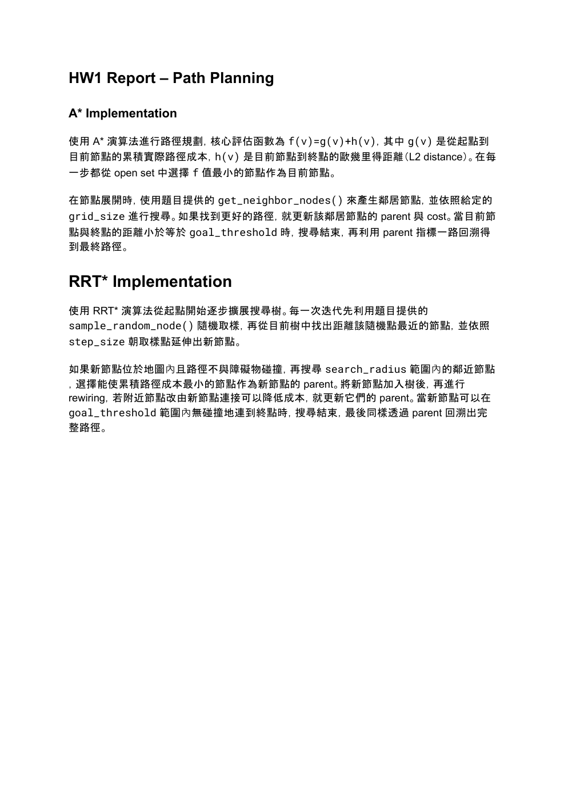

# HW1 Report: Path Planning

Implementation notes for A* and RRT* path-planning algorithms, including cost evaluation, node expansion, collision checking, rewiring, and path reconstruction.

**[Open the PDF in your browser](https://anyi-lee.github.io/robotic-navigation-and-exploration/hw1-path-planning/report/hw1-report.pdf)**

## First-page preview

