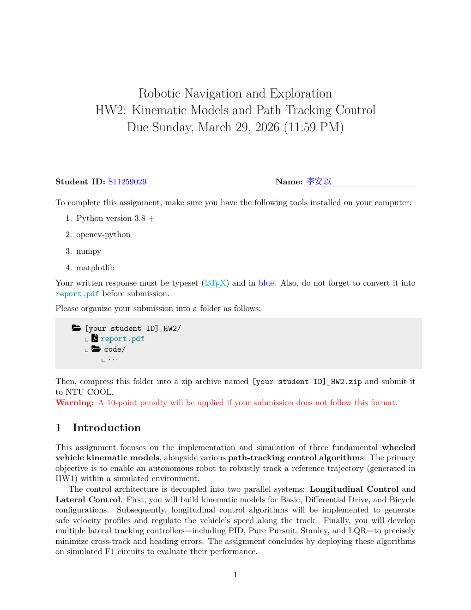

# HW2 Report: Kinematic Models and Path-Tracking Control

Implementation and evaluation of wheeled-vehicle kinematic models and path-tracking controllers, including PID, Pure Pursuit, Stanley, and LQR methods.

**[Open the PDF in your browser](https://anyi-lee.github.io/robotic-navigation-and-exploration/hw2-motion-control/report/hw2-report.pdf)**

## First-page preview

