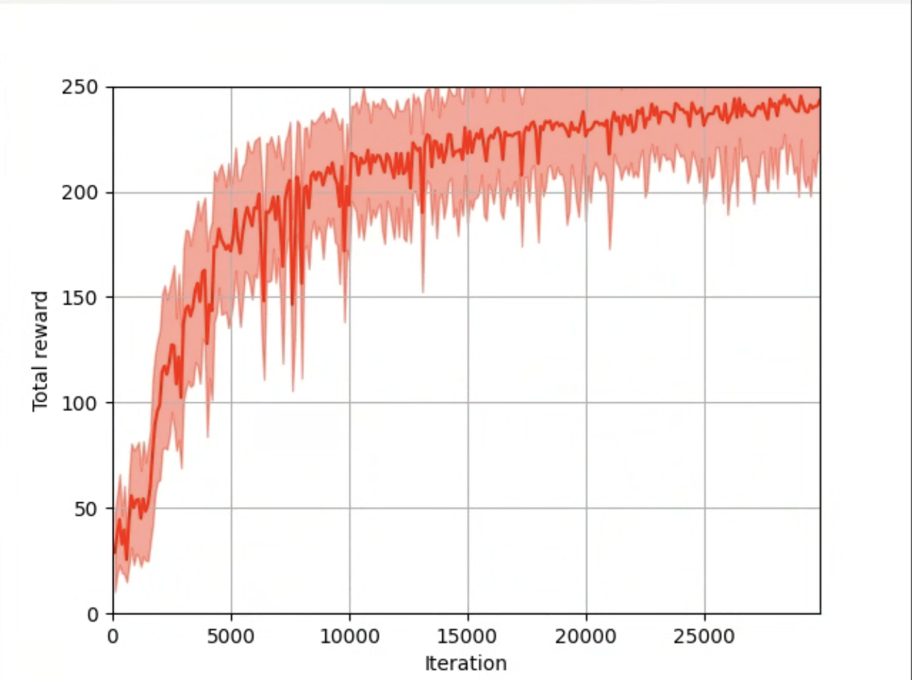
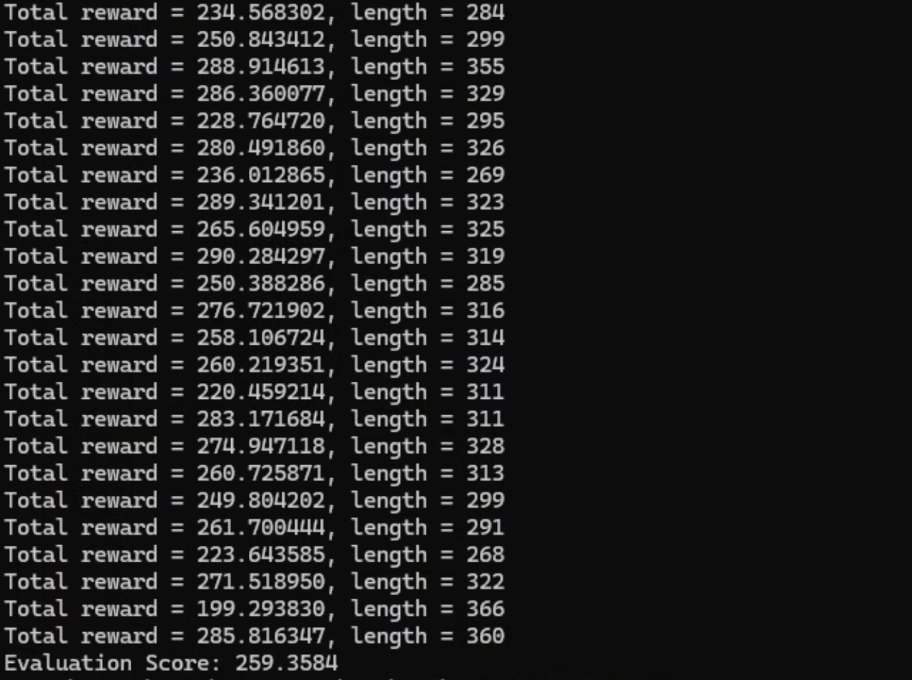

# HW3: Deep Reinforcement Learning

This assignment contains two reinforcement-learning tasks: a PPO path-tracking agent and reward design for the Proly checkpoint environment.

## PPO path tracking

I implemented:

- Actor and critic multilayer perceptrons
- Batched trajectory collection
- Generalized advantage estimation data flow
- PPO clipped policy objective
- Hyperparameter tuning for stable training

Final training settings included 8 parallel environments, 256 rollout steps, discount factor 0.99, GAE factor 0.95, PPO clip value 0.15, and learning rate `2e-4`.

The mean return stabilized around 230–240. The final evaluation score was **259.3584**, above the assignment's full-score threshold of 120.

## Proly reward shaping

The Proly environment provided the PPO implementation and fixed observation/action spaces. I designed a reward function combining:

- A large positive reward for capturing a new checkpoint
- Dense progress feedback based on distance to the next checkpoint
- Survival reward and penalties for health loss

The trained agent consistently captured all 10 checkpoints on public maps 1 and 2. Additional training improved map 3 to full-checkpoint completion in most later episodes.

## Materials

- [`src/`](src/): submitted implementation files
- [Report overview and previews](report/)
- [Open the PPO path-tracking PDF](https://anyi-lee.github.io/robotic-navigation-and-exploration/hw3-reinforcement-learning/report/ppo-path-tracking-report.pdf)
- [Open the Proly reward-design PDF](https://anyi-lee.github.io/robotic-navigation-and-exploration/hw3-reinforcement-learning/report/proly-reward-design-report.pdf)
- [`results/path-tracking-model.pt`](results/path-tracking-model.pt): final PPO checkpoint

The files depend on course-provided environments and utilities that are not redistributed here.
