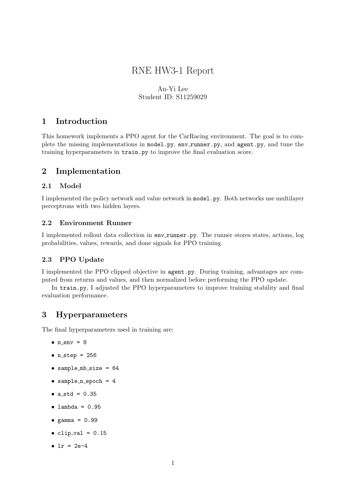
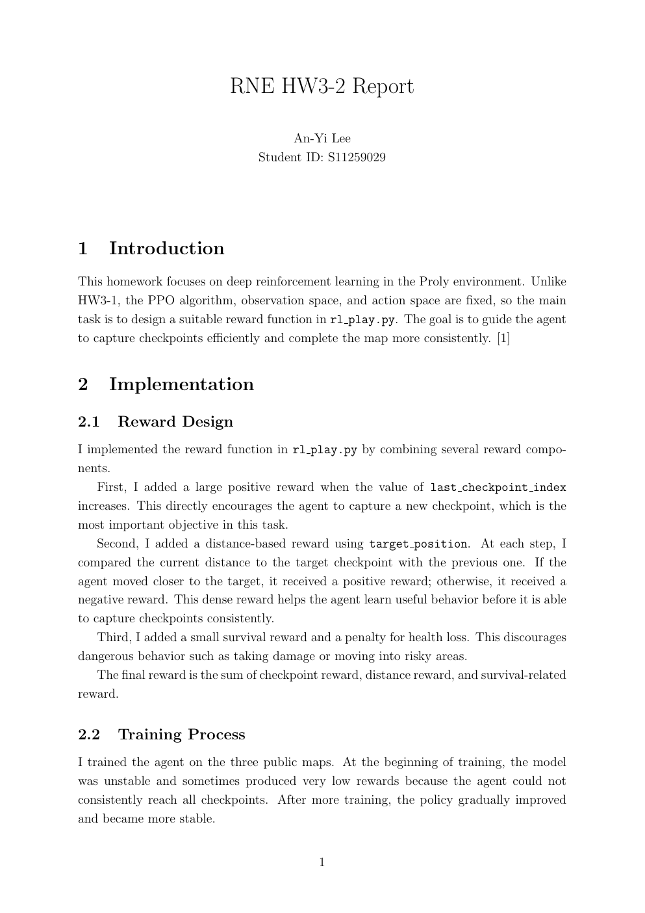

# HW3 Reports: Reinforcement Learning

Two reports document the reinforcement-learning coursework: implementing and tuning a PPO agent for path tracking, followed by task-specific reward design for the Proly environment.

## PPO Path Tracking

**[Open the PPO report in your browser](https://anyi-lee.github.io/robotic-navigation-and-exploration/hw3-reinforcement-learning/report/ppo-path-tracking-report.pdf)**

## Proly Reward Design

**[Open the reward-design report in your browser](https://anyi-lee.github.io/robotic-navigation-and-exploration/hw3-reinforcement-learning/report/proly-reward-design-report.pdf)**

