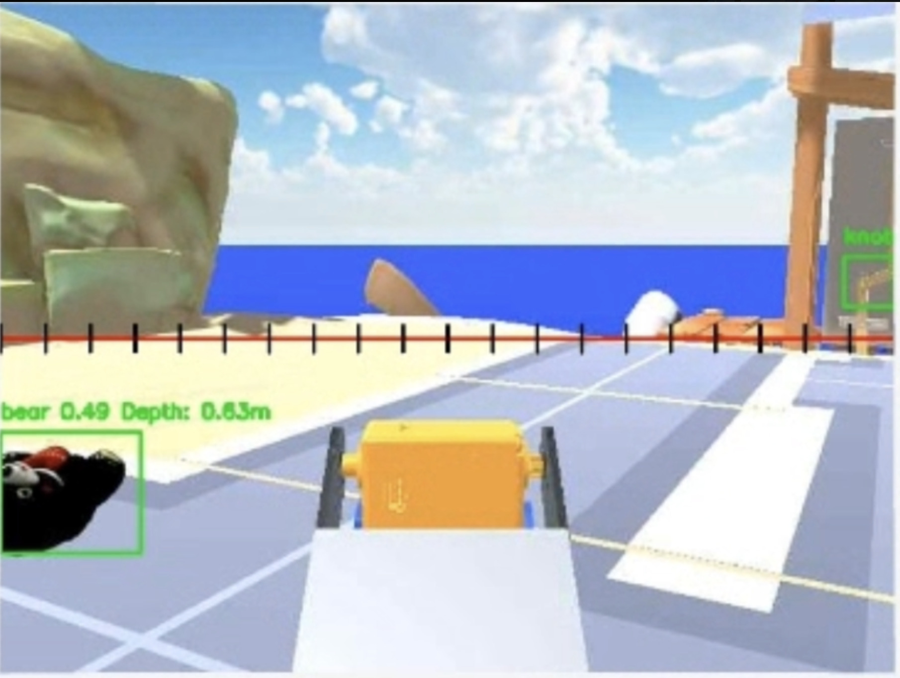
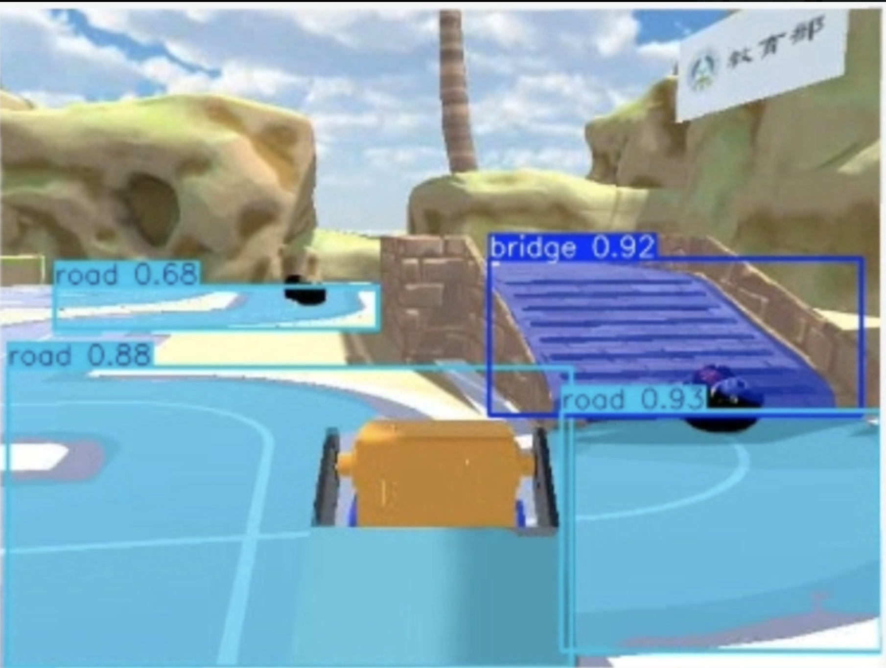

# HW4: YOLO Object Detection and Semantic Segmentation

This project develops two perception models for the PROS Twin robot environment:

- Object detection for **bear** and **knob**
- Semantic segmentation for **road** and **bridge**

## Dataset and training

I collected and labeled 82 images from multiple viewpoints and distances in PROS Twin using Roboflow.

| Task | Model | Split | Training |
| --- | --- | --- | --- |
| Detection | YOLO11n | 57 train / 16 validation / 9 test | 50 epochs, batch 8, image size 640 |
| Segmentation | YOLO11n-seg | 58 train / 16 validation / 8 test | 50 epochs, batch 4, image size 640 |

## Results

| Object detection | Semantic segmentation |
| --- | --- |
|  |  |
| [Watch detection demo](assets/detection-demo.mp4) | [Watch segmentation demo](assets/segmentation-demo.mp4) |

The ROS 2 inference node combines YOLO output with RGB-D data and publishes the selected target's detection state, distance, horizontal image offset, and vertical center through `/yolo/target_info`.

## Materials

- [`src/object_detection_node.py`](src/object_detection_node.py): ROS 2 perception integration
- [`models/detection.pt`](models/detection.pt): trained detection weights
- [`models/segmentation.pt`](models/segmentation.pt): trained segmentation weights
- [Full report](report/hw4-report.pdf)

