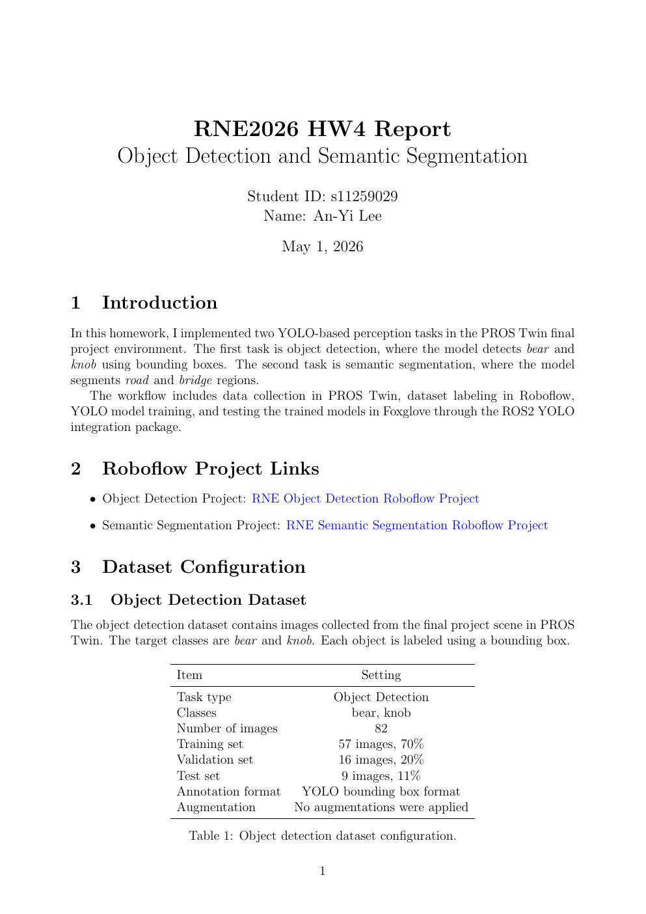

# HW4 Report: Object Detection and Semantic Segmentation

YOLO-based perception experiments for the PROS Twin environment: bear and knob object detection, plus road and bridge semantic segmentation using custom Roboflow datasets.

**[Open the PDF in your browser](https://anyi-lee.github.io/robotic-navigation-and-exploration/hw4-visual-perception/report/hw4-report.pdf)**

## First-page preview

